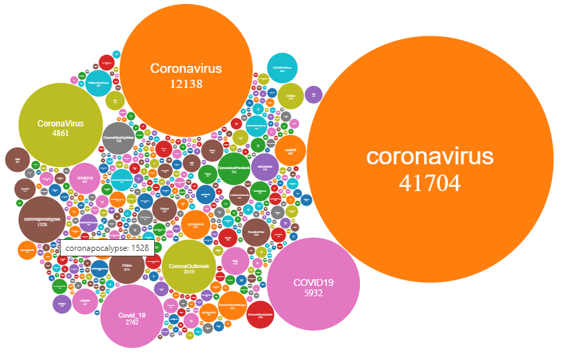
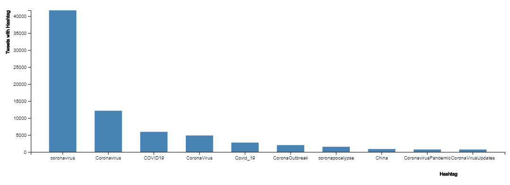

# **Project Phase 2 - Analyzing Tweets**
## **Principles of Big Data Management \(CS 5540\)**
----------------
>## **Authors**: 
>- ## **Jonnathan Wolfe**
>- ## **Rod Skoglund**
>### Date: April 25, 2020
----------------


# **Table Of Contents**
1. [Design](#1.-design)
2. [Tweet Storage](#2.-tweet-storage)
3. [Queries](#3.-queries)
4. [Visualizations](#4.-visualizations)
5. [Code](#5.-code)
6. [Demo](#6.-Demo)
7. [Work Assignments](#7.-work-assignments)
----------------

# 1. Design
>The design involved several steps to develop this analysis.
  1. Installed Cloudera which includes the following:
      * Hadoop
      * Spark
      * Yarn
  2. Developed Java script to pull Tweet information and extract Hashtags and URLS
      * Captured 100K tweets, approximately 10 hours of stream sampling
      * Used Java library, twitter4j-4.0.7, to access Twitter Streaming API
      * Selected tweets over all other messages
      * Excluded retweets and replies
      * Only captured tweets containing Hashtags or URLs
      * Saved the collected tweets into files with each tweet JSON per line
      * Extracted Hashtags and URLs from the collected tweets
      * Saved the Hashtags and URLs into a text file with 10 Hashtags or URLs per line
      * All files were limited to approximately 64MB size by writting a new file if it may exceed the size
  3.    Used the Spark Word Counter capability to produce the word count analysis data.
		   * Used Cloudera default configuration on a pseudo-distributed system
		   * Transferred files with extracted Hashtags/URLs into hadoop file system within the VM
		   * Transferred files were saved in a input folder to be used by Spark
		   * Once Spark was finished, the results were extracted from hadoop and transferred out of the VM
  4. Developed and implemented queries to provide data for visualations
  5. Used D3 to create visualations including 
      * A Bubble Chart to compare the different Hashtags associated with the corona virus and how often each Hashtag is used.
      * A Bar Chart to show the top Hashtags in use.
---

# **2. Tweet Storage**
>Text text text 
---

# **3. Queries**
>Here are the queries we used to get and analyze the data:
1. Bubble Chart Data
```java
  hashtag.createOrReplaceTempView("thash");
  Dataset<Row> hashtagCount = spark.sql("Select col.text as text, count(col.text) as count from thash group by text");
  hashtagCount = hashtagCount.filter("count > 10");
  String counts = hashtagCount.toJSON().toJavaRDD().collect().toString();
```
2. Influencers
```java
		Dataset<Row> users = data.filter("user.followers_count is not null")
				.filter("user.verified is not null").filter("user.name is not null");
		
		Dataset<Row> influencers = users.select("user.name", "user.followers_count", "user.verified")
		.groupBy("name")
		.agg(max("followers_count").alias("followers_count"), max("verified").alias("verified"))
		.orderBy(desc("followers_count")).limit(50);
		String influencerStr = influencers.toJSON().toJavaRDD().collect().toString();
```
3. Top Hashtags Overall
```java
    hashtag.createOrReplaceTempView("thash");
  	Dataset<Row> hashtagCount = spark.sql("Select col.text as text, count(col.text) as count from thash group by text order by count desc limit 10");
  	return hashtagCount.toJSON().toJavaRDD().collect();

```

4. Bots Data - made up from multiple queries
```java
  users = data.filter("user.statuses_count is not null")
		.filter("user.created_at is not null").filter("created_at is not null");

  adjUsers = users.withColumn("created_at", unix_timestamp(users.col("created_at"), "EEE MMM dd HH:mm:ss ZZZZZ yyyy").cast("timestamp"));
	adjUsers = adjUsers.withColumn("user_created_at", unix_timestamp(adjUsers.col("user.created_at"), "EEE MMM dd HH:mm:ss ZZZZZ yyyy").cast("timestamp"));
	adjUsers = adjUsers.withColumn("Days_since_started", datediff(adjUsers.col("created_at"), adjUsers.col("user_created_at")));
	adjUsers = adjUsers.withColumn("Tweets_per_day", adjUsers.col("user.statuses_count").divide(adjUsers.col("Days_since_started")));

  botsTweets = adjUsers.filter("Tweets_per_day > 50").select("Tweets_per_day", "Days_since_started", "user.name", "user.description");

  botData = botsTweets.groupBy("name").agg(avg("Tweets_per_day").alias("Tweets_per_day")).orderBy(desc("Tweets_per_day")).limit(50);

```

---

# **4. Visualizations**
Our analysis included a Bubble Chart with a sample of 100k corona relatrd tweets. Each bubble is a different corona virus Hashtag with the number of tweets associated with that Hashtag. This only shows Hashtags with more than 10 tweets.
### Corona Virus Hashtag Bubble Chart:


We also included a Bar Chart with the top 10 Hashtags Hashtags.
### Corona Virus Top 10 Hashtag Bar Chart:


---

# **5. Code**
The code is stored and managed via GitHub. It is available at [Wolfe-Skoglund GitHub code](https://github.com/JAWolfe04/CS5540-Big-Data-Project.git)
---

# **6. Demo**
The Demo will be shown to the instructor and TA's at a convenient date/time.
---

# **7. Work Assignments**

- Installations & Setup: 
  *	Wolfe
  * Skoglund
- Coding:
  * Wolfe \(99%\)
  * Skoglund \(1%\)
- Phase #2 documentation:
  *	Wolfe
  * Skoglund
 
---
